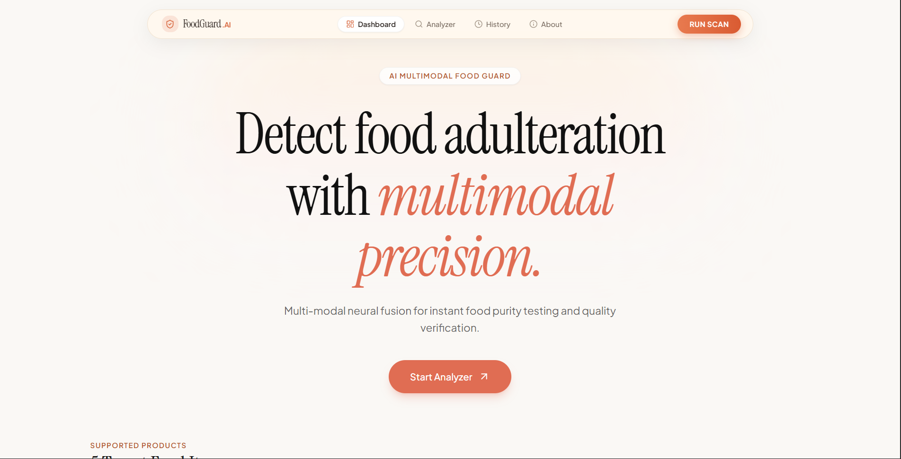

# FoodGuard-AI

### AI-Powered Food Adulteration Detection System

FoodGuard-AI is an AI-based food adulteration detection system designed to identify potential adulteration in food products using computer vision and deep learning.

The project aims to provide a simple interface where users can upload an image of a food product and receive an adulteration prediction along with visual explanations of the model's decision.

---

## Preview

<!-- Add your landing page screenshot here -->



## Overview

Food adulteration is a major concern because adulterated food can affect consumer health and food quality. Traditional detection methods often require laboratory equipment, specialized expertise, and significant time.

FoodGuard-AI explores the use of deep learning and computer vision to make preliminary food adulteration detection more accessible.

The system is being designed around three possible input modalities:

* **Image**: Visual information from the food sample
* **Text**: Information related to the food/sample
* **Additional modality**: Supporting information used by the multimodal model

The system is being developed so that **image input can be used independently**, while additional modalities can be incorporated when available.

---

## Key Features

* AI-based food adulteration detection
* Image-based food sample analysis
* Multimodal learning support
* Deep learning-based classification
* Visual model explanations using Grad-CAM
* Web-based interface for interacting with the model
* Designed to support image-only inference when other modalities are unavailable

---

## Machine Learning

The project currently explores multiple deep learning architectures for image analysis.

### Vision Transformer (ViT)

Vision Transformer is used to learn visual representations from food images.

Instead of processing an image purely through convolution operations, ViT divides the image into patches and processes these patches using transformer-based attention mechanisms.

### EfficientNet-V2

EfficientNet-V2 is another image classification architecture being explored for efficient and accurate visual feature extraction.

It provides a strong balance between model performance and computational efficiency.

### CMAFN

The project also uses a **multimodal feature learning architecture, CMAFN**, to combine information from multiple modalities.

The multimodal pipeline is being adapted so that the image modality remains the primary input while the other modalities can be optional.

---

## Explainability

### Grad-CAM

Grad-CAM is used to understand which regions of an input image influenced the model's prediction.

This produces a heatmap over the image, allowing users to see the areas that contributed most strongly to the prediction.

This is particularly useful because the system should not only provide a prediction but also provide some insight into **why the model made that prediction**.

---

## System Workflow

```text
                User
                 |
                 v
          Upload Food Image
                 |
                 v
          Image Preprocessing
                 |
                 v
        Deep Learning Model
                 |
        +--------+--------+
        |                 |
        v                 v
   Prediction          Grad-CAM
        |                 |
        +--------+--------+
                 |
                 v
          Results / Analysis
```

For the multimodal pipeline:

```text
Image ───────────────┐
                     |
Text ────────────────┼──> Feature Extraction
                     |          |
Additional Data ────┘          v
                         Multimodal Fusion
                                |
                                v
                         Classification
                                |
                                v
                           Prediction
```

---

## Tech Stack

### Machine Learning

* Python
* PyTorch
* Vision Transformer
* EfficientNet-V2
* CMAFN
* Grad-CAM
* NumPy
* Pandas
* Scikit-learn

### Backend

* Express

### Frontend

* React
* JavaScript / TypeScript
* Tailwind CSS

### Deployment

* Vercel for the frontend
* Backend/model deployment planned as part of the final integration

---

## Dataset

The project uses a food adulteration dataset containing food samples and their corresponding labels.

The dataset is being used to train and evaluate the deep learning models.

The current training pipeline is still under development, so final performance metrics will be added after model training and evaluation are completed.

---

## Project Structure

```text
FoodGuard-AI/
│
├── frontend/              # React frontend
│
├── backend/               # Backend/API
│
├── models/                # ML models
│
├── dataset/               # Dataset / preprocessing
│
├── training/              # Model training scripts
│
├── notebooks/             # Experiments and analysis
│
├── requirements.txt       # Python dependencies
│
└── README.md
```

The exact structure may change as development progresses.

---

## Current Progress

* [x] Frontend interface
* [x] Initial project architecture
* [x] Dataset preparation
* [x] Initial model selection
* [x] Image classification pipeline development
* [x] Multimodal architecture research
* [ ] Complete model training
* [ ] Model evaluation
* [ ] Grad-CAM integration
* [ ] Backend model integration
* [ ] End-to-end testing
* [ ] Final deployment
* [ ] Performance benchmarking

---

## Future Improvements

* Improve model accuracy
* Support additional food categories
* Improve multimodal fusion
* Optimize inference speed
* Add confidence scores
* Improve explainability
* Deploy the final trained models
* Add more comprehensive evaluation metrics
* Expand the dataset

---

## Disclaimer

FoodGuard-AI is an academic/research project intended to explore the application of artificial intelligence to food adulteration detection.

Predictions generated by the system should not be considered a replacement for professional laboratory testing or certified food safety analysis.

---

## Team

Developed as a **VTU academic major project** focused on applying deep learning and multimodal AI to food adulteration detection.

---

## Project Status

**🚧 Work in Progress**

The project is currently under active development. Model training, evaluation, and final system integration are ongoing.
